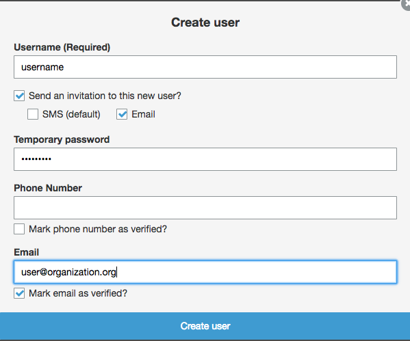

# tpkCloudFormation

CloudFormation templates for the tpk backend and frontend stacks.

## Backend stack

This template uses the [serverless-application-model](https://github.com/awslabs/serverless-application-model/blob/master/HOWTO.md).
Because the serverless-application-model uses a [transform](http://docs.aws.amazon.com/AWSCloudFormation/latest/UserGuide/transform-section-structure.html)
it is necessary to use the `deploy` [command](http://docs.aws.amazon.com/AWSCloudFormation/latest/UserGuide/using-cfn-cli-deploy.html) to deploy the stack.

Ensure that the credentials associated with the IAM group used by the [awscli](https://aws.amazon.com/cli/)
have sufficient privleges for creating the resources described in the template.

To create the backend stack run

```bash
aws cloudformation deploy --template-file template.json /
--stack-name stackName --capabilities CAPABILITY_NAMED_IAM /
--parameter-overrides AdministratorEmail=email@email.org /
SourceEmail=email@email.org
```
`stackName` is the name of your backend stack.

`AdministratorEmail` is the email address which will receive notifications when
a tpk job fails in AWS Batch.

`SourceEmail` is the 'From' email address used to send notifications to users when
completed tpks are completed or a tpk job has failed.

For use with [AWS SES](https://aws.amazon.com/ses/) the `SourceEmail` will need to be [verified](http://docs.aws.amazon.com/ses/latest/DeveloperGuide/verify-email-addresses.html)
via the AWS console.

In addition to send email to an unrestricted list of recipients the SES account
needs to be [moved out](http://docs.aws.amazon.com/ses/latest/DeveloperGuide/request-production-access.html) of the sandbox via the AWS console.

## Frontend stacks

The `frontendTemplate.json` depends on cross stack [references](http://docs.aws.amazon.com/AWSCloudFormation/latest/UserGuide/walkthrough-crossstackref.html)
to resources created in the backend stack so the backend stack must be created
first.  `frontendTemplate.json` uses [CodePipeline](https://aws.amazon.com/codepipeline/)
for tracking updates to the front end application repositories.  There can be a
small delay after the stack is create before the CodePipeline places the built
assets in the relevant S3 bucket.

### tpkrequest

To deploy the [tpkrequest](https://github.com/sharkinsspatial/tpkrequest)

```bash
aws cloudformation deploy --template-file frontendTemplate.json /
--stack-name stackName --capabilities CAPABILITY_NAMED_IAM /
--parameter-overrides BackendStack=backendStack GitHubOAuthToken=token /
MapboxToken=token GitHubOwner=sharkinsspatial GitHubRepo=tpkrequest /
GitHubBranch=master WebsiteAddress=domainName
```

### tpkdashboard

To deploy the [tpkdashboard](https://github.com/sharkinsspatial/tpkdashboard)

```bash
aws cloudformation deploy --template-file frontendTemplate.json /
--stack-name stackName --capabilities CAPABILITY_NAMED_IAM /
--parameter-overrides BackendStack=backendStack GitHubOAuthToken=token /
MapboxToken=token GitHubOwner=sharkinsspatial GitHubRepo=tpkdashboard/
GitHubBranch=master WebsiteAddress=domainName
```

`BackendStack` is the name of the backend stack created by the deploy described
in the backend section.

`GitHubOAuthToken` is an OAuth token for CodePipeline to access git commit hooks.
Instructions on how to generate a token can be found [here](https://help.github.com/articles/creating-a-personal-access-token-for-the-command-line/).
The following scopes are required for CodePipeline `repo:status` and `admin:repo_hook`

`MapboxToken` is a valid Mapbox [token](https://www.mapbox.com/help/how-access-tokens-work/). 

`WebsiteAddress` is the web address to host the website at. Use the desired
domain name for the application (e.g dgmapsapi.com for tpkrequest). 
An S3 bucket will be created with the same address. This bucket must not already exist
globally anywhere in S3. (This is a requirement/limitation of s3-website.)
Do not prefix with http e.g. dgmapsapi.com.

## DNS Configuration

The `frontendTemplate.json` creates a Hosted Zone and Alias Records for the
buckets in AWS Route 53.  To use a custom domain (as specified in the
`WebsiteAddress` parameter) follow the instructions available from [Step 4](http://docs.aws.amazon.com/AmazonS3/latest/dev/website-hosting-custom-domain-walkthrough.html#root-domain-walkthrough-update-ns-record).


## Adding users

In the AWS console navigate to the Cognito [console](https://console.aws.amazon.com/cognito/home?region=us-east-1)
and click 'Manage your User Pools'.

From 'Your User Pools' select 'TpkCognitoUserPool'.

Under 'General Settings' on the left, select 'Users and groups'.


Click 'Create User'.  And you are presented with the following dialog



'Send and invitation to this new user?' is checked.

'SMS' is unchecked.

'Email' is checked.

'Mark email as verified?' is checked.

The user will receive an email with a link to the application's updateUser page
where they can use their temporary password to update their account information.

All users have access to the create tile pacakges using the tpkrequest
application.  Users can use the tpkdashboard app to view the history of tpk jobs 
they have created.  By default, users may only view tpk jobs they have created
themselves.

There are two Cognito user groups which control administrative
access to the tpkdashboard.  The `admin` group allows users to view all tpk jobs
created by members of their organization.  The `dgadmin` group allows users to see
all tpk jobs created in the system.

After the user has been successfully added.  You are presented with the user
page containing the following buttons at the top.


If you wish to add the user to an adminstrative group click the 'Add to group'
button and choose the appropriate group from the dropdown menu.
